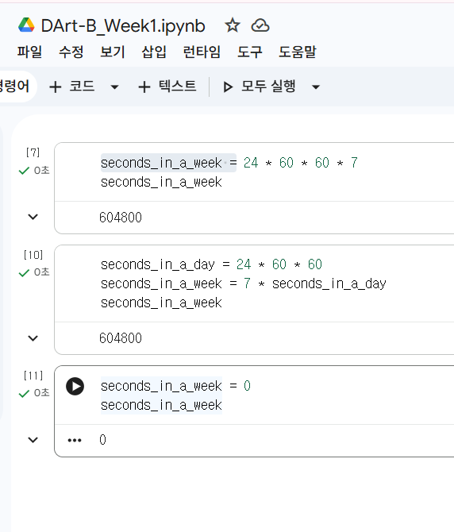
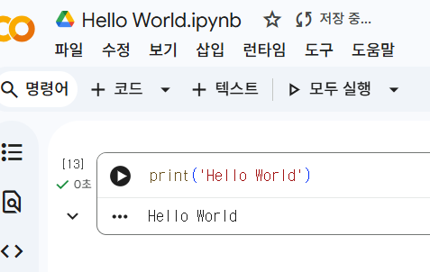
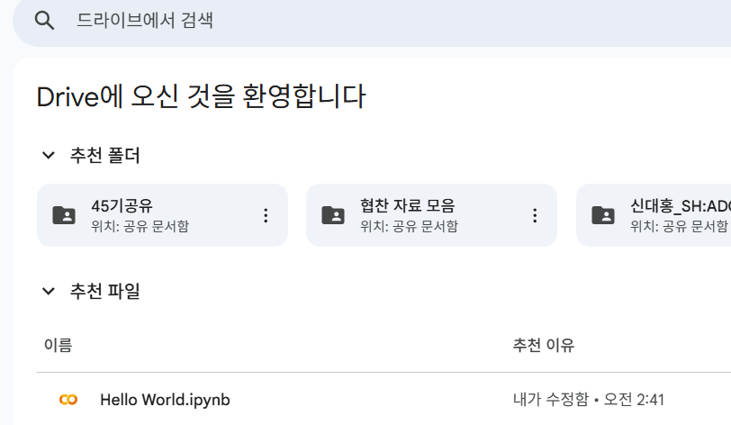
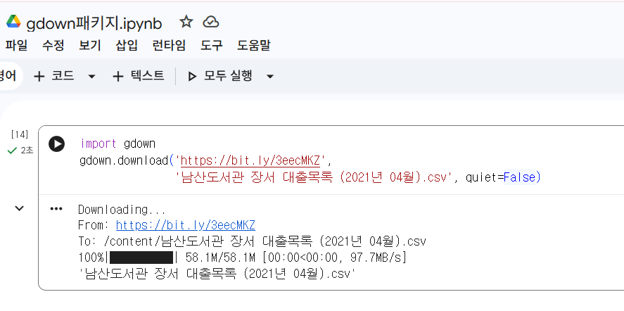
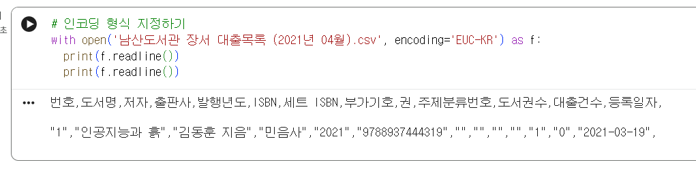
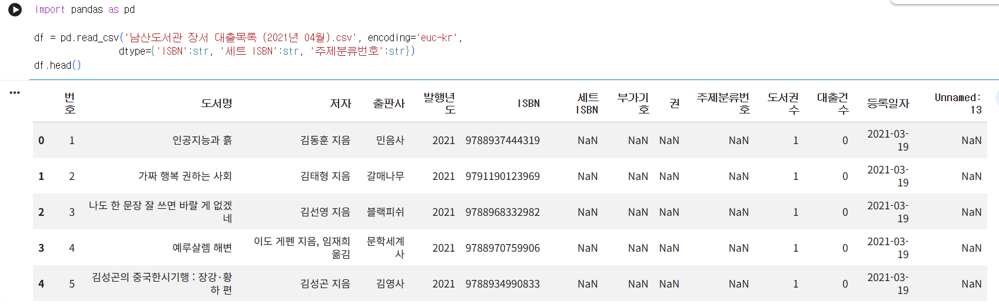

# 데이터분석 1주차 정규과제

📌데이터분석 정규과제는 매주 정해진 분량의 『*혼자 공부하는 데이터 분석 with 파이썬*』 을 읽고 학습하는 것입니다. 이번 주는 아래의 **DataAnalysis_1st_TIL**에 나열된 분량을 읽고 공부하시면 됩니다.

아래의 문제를 풀어보며 학습 내용을 점검하세요. 문제를 해결하는 과정에서 개념을 스스로 정리하고, 필요한 경우 제시된 강의를 참고하여 보완하는 것이 좋습니다.

<!-- 강의 링크는 아래와 같습니다.
https://www.youtube.com/watch?v=qGE_rT_oQaQ&list=PLVsNizTWUw7FGzSRCkQrPEEe-ljVXgS7k
https://www.youtube.com/watch?v=tp9XmeaHU0E&list=PLVsNizTWUw7FGzSRCkQrPEEe-ljVXgS7k&index=2
https://www.youtube.com/watch?v=D46j-e_IHlI&list=PLVsNizTWUw7FGzSRCkQrPEEe-ljVXgS7k&index=3
-->

## DataAnalysis_1st_TIL

### 1장 데이터 분석을 시작하며
#### 01. 데이터 분석이란
#### 02. 구글 코랩과 주피터 노트북
#### 03. 이 도서가 얼마나 인기가 좋을까요?

## Study Schedule

| 주차  | 공부 범위     | 완료 여부 |
| ----- | ------------- | --------- |
| 1주차 | p.24~81    | ✅         |
| 2주차 | p.84~151   | 🍽️         |
| 3주차 | p.154~219  | 🍽️         |
| 4주차 | p.222~279 | 🍽️         |
| 5주차 | p.282~325 | 🍽️         |
| 6주차 | p.328~379 | 🍽️         |
| 7주차 | p.382~430 | 🍽️         |

 

<!-- 여기까진 그대로 둬 주세요-->

# 1️⃣ 개념 정리 

## 01. 데이터 분석이란

### 데이터 분석과 데이터 과학의 차이점
##### 데이터 분석 : 올바른 의사 결정을 돕기 위해 데이터를 조사, 정제, 변환, 모델링하여 유용한 통찰을 제공하는 작업에 초점을 둔다.
##### 데이터 과학 : 데이터 분석, 통계학, 머신러닝, 데이터 마이닝 등을 아우르는 보다 포괄적인 개념으로, 실질적인 문제 해결을 위한 최선의 솔루션 구축을 목표로 한다.

### 통계적 관점에서의 데이터 분석
##### 기술통계 : 수집한 데이터를 평균, 최솟값, 최댓값 등으로 정량화하거나 요약하는 기법
##### 탐색적 데이터 분석(EDA) : 시각화 도구(그래프 등)를 활용해 데이터의 주요 특성을 파악하는 기법
##### 가설검정 : 주어진 데이터를 근거로 특정 가정이 통계적으로 타당한지 검증하는 방법

## 02. 구글 코랩과 주피터 노트북

### 구글 코랩의 특징
##### 웹 브라우저에서 파이썬 코드를 작성하고 실행할 수 있는 클라우드 기반 주피터 노트북 환경이다.
##### 로컬 환경에 파이썬 및 라이브러리를 직접 설치할 필요 없이 구글 가상 서버 자원을 활용한다.
##### 작업 파일은 구글 드라이브에 자동 저장되며 손쉽게 공유할 수 있다. 

### 노트북의 셀(Cell) 구조
##### 텍스트 셀 : 마크다운과 HTML 서식을 지원하여 코드에 대한 문서화 작업을 함께 수행할 수 있다.
##### 코드 셀 : 파이썬 코드를 입력하고 실행하는 단위로, 마지막 행의 결괏값을 print() 없이도 자동 출력한다.  

## 03. 이 도서가 얼마나 인기가 좋을까요?

### 데이터 수집 및 대체 데이터 발굴
##### 서점의 직접적인 도서 판매량 데이터를 구하기 어려울 때, 공공데이터포털이나 도서관 정보나루의 도서관 대출 데이터를 대체 데이터로 활용하는 전략을 학습했다.

### 파일 인코딩(Encoding) 문제 해결
##### 파이썬의 기본 읽기 인코딩은 UTF-8이므로 한글 완성형(EUC-KR) 파일 로드 시 UnicodeDecodeError가 발생할 수 있다.
##### chardet.detect() 함수를 사용하여 바이너리 모드('rb')로 읽은 데이터의 인코딩 방식을 진단할 수 있다.
##### open() 함수나 pd.read_csv()의 encoding='EUC-KR' 옵션을 통해 정상적으로 한글을 로드할 수 있다. 

# 2️⃣ 수행 인증

 
 

# 3️⃣ 확인 문제

## 문제 1.

> **🧚Q. 데이터 분석의 개념을 넓은 의미와 좁은 의미로 나누어 설명하고, 두 개념의 차이점도 함께 정리해주세요.**

### 좁은 의미의 데이터 분석 :
##### 수집 및 가공이 완료된 데이터를 바탕으로 통계적 기법을 적용하는 과정을 의미한다.
##### 기술통계(데이터 요약 및 정량화), 탐색적 데이터 분석(EDA, 시각화를 통한 특성 파악), 가설검정(통계적 가설 검증) 등이 이에 해당한다.

### 넓은 의미의 데이터 분석 :
##### 비즈니스 문제 정의부터 시작하여 데이터 수집, 데이터 처리(전처리), 데이터 정제, 분석, 그리고 모델링까지의 데이터 라이프사이클 전 과정을 포괄하는 개념이다.

### 두 개념의 차이점 :
##### 포함하는 작업 범위에서 가장 큰 차이가 있다.
##### 좁은 의미의 데이터 분석이 이미 정제된 데이터를 다루는 통계 및 시각화 분석 기법 자체에 집중한다면, 넓은 의미의 데이터 분석은 데이터를 수집하고 분석 가능한 형태로 가공하는 전처리 및 최종 문제 해결을 위한 모델링까지 전체 파이프라인을 하나의 분석 과정으로 본다.

### 🎉 수고하셨습니다.
