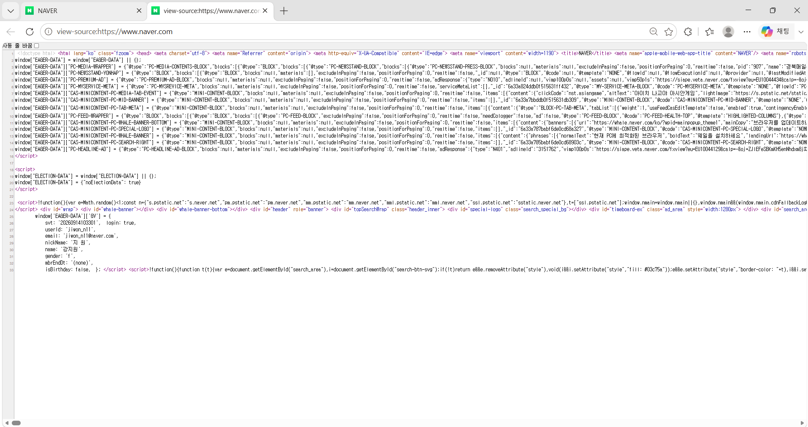
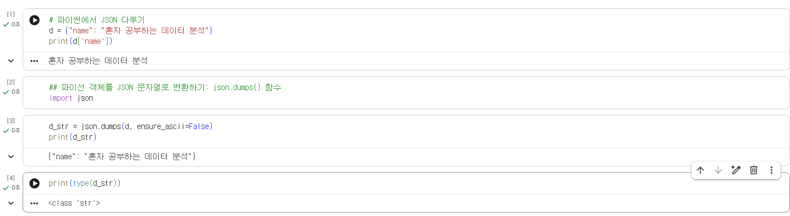
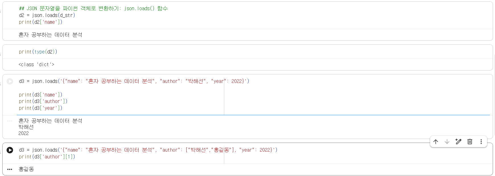
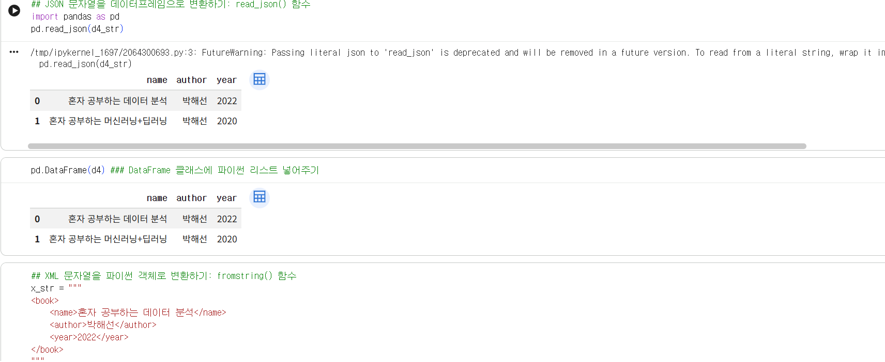
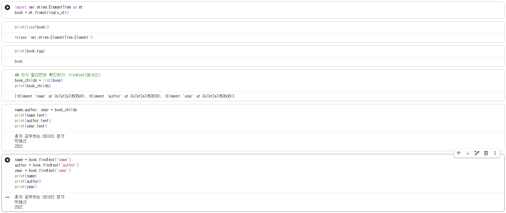
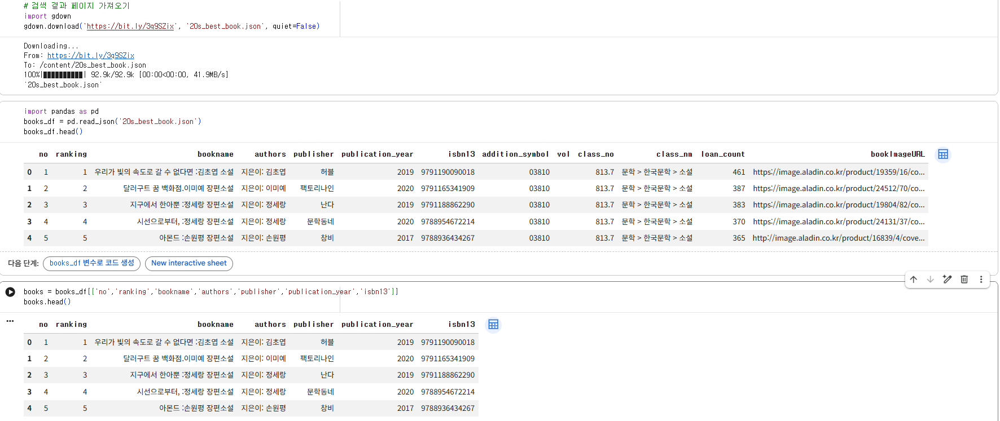

# 데이터분석 2주차 정규과제

📌데이터분석 정규과제는 매주 정해진 분량의 『*혼자 공부하는 데이터 분석 with 파이썬*』 을 읽고 학습하는 것입니다. 이번 주는 아래의 **DataAnalysis_2nd_TIL**에 나열된 분량을 읽고 공부하시면 됩니다.

아래의 문제를 풀어보며 학습 내용을 점검하세요. 문제를 해결하는 과정에서 개념을 스스로 정리하고, 필요한 경우 제시된 강의를 참고하여 보완하는 것이 좋습니다.

<!-- 강의 링크는 아래와 같습니다.
https://www.youtube.com/watch?v=s_-VvTLb3gs&list=PLVsNizTWUw7FGzSRCkQrPEEe-ljVXgS7k&index=4
https://www.youtube.com/watch?v=Il6L8OtNFpc&list=PLVsNizTWUw7FGzSRCkQrPEEe-ljVXgS7k&index=5
-->


## DataAnalysis_2nd_TIL

### 2장 데이터 수집하기
#### 01. API 사용하기
#### 02. 웹 스크래핑 사용하기


## Study Schedule

| 주차  | 공부 범위     | 완료 여부 |
| ----- | ------------- | --------- |
| 1주차 | p.24~81    | ✅         |
| 2주차 | p.84~151   | ✅         |
| 3주차 | p.154~219  | 🍽️         |
| 4주차 | p.222~279 | 🍽️         |
| 5주차 | p.282~325 | 🍽️         |
| 6주차 | p.328~379 | 🍽️         |
| 7주차 | p.382~430 | 🍽️         |

<br>

<!-- 여기까진 그대로 둬 주세요-->


# 1️⃣ 개념 정리 

## 01. API 사용하기

- 데이터베이스에 직접 접근하기 어려울 때 HTTP 기반의 API를 통해 JSON, XML 형식으로 안전하고 규격화된 데이터를 수집할 수 있음을 알게 되었다. 
- 파이썬의 json 모듈(dumps, loads)과 xml.etree.ElementTree를 활용하여 텍스트 데이터의 직렬화와 역직렬화 및 계층적 요소 추출 원리를 이해했다. 
- requests.get() 함수로 오픈 API에 파라미터를 전달해 데이터를 호출하고 이를 판다스 데이터프레임으로 변환하여 파일로 저장하는 자동화 과정을 배웠다.  

## 02.웹 스크래핑 사용하기

- API가 없는 경우 웹 페이지의 HTML 소스를 직접 분석하여 필요한 정보를 추출하는 웹 스크래핑 기법과 사전에 robots.txt를 확인해야 하는 주의점을 배웠다. 
- 크롬 개발자 도구로 타깃 태그를 파악한 뒤 BeautifulSoup의 find(), find_all(), get_text() 메서드를 사용해 원하는 텍스트만 정밀하게 추출하는 법을 알게 되었다. 
- 판다스 데이터프레임의 apply() 메서드로 각 행의 데이터에 스크래핑 함수를 일괄 적용하고 수집된 결과를 pd.merge()로 기존 데이터와 병합하는 방법을 배웠다.  


# 2️⃣ 수행 인증








<br>
<br>

# 3️⃣ 확인 문제

## 문제 1.

> **🧚Q. 다음 중 BeautifulSoup 외에 웹 스크래핑에 사용할 수 있는 파이썬 패키지로 가장 적절한 것은 무엇인가요?**

```
1️⃣ NumPy  
2️⃣ Scrapy  
3️⃣ Matplotlib  
4️⃣ Scikit-learn  
```

```
정답: 2️⃣ Scrapy

교재 125쪽 '여기서 잠깐'에서도 소개되었듯이, Scrapy(스크래피)는 웹 데이터를 수집하기 위해 requests와 BeautifulSoup의 기능을 합쳐 놓은 것과 유사하게 설계된 대표적인 파이썬 전용 웹 스크래핑/크롤링 프레임워크이다. 참고로 1번 NumPy는 수치 계산, 3번 Matplotlib은 데이터 시각화, 4번 Scikit-learn은 머신러닝 라이브러리이므로 웹 스크래핑 용도로 적절하지 않다.
```


### 🎉 수고하셨습니다.
