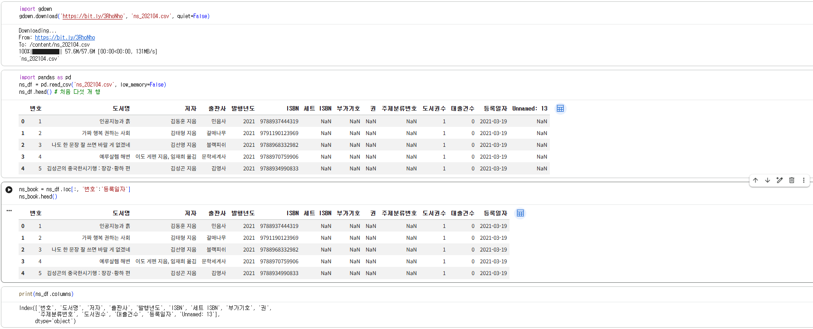
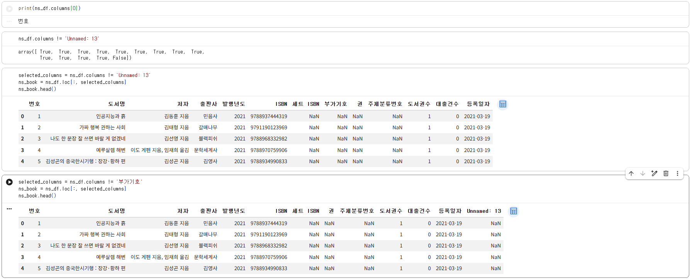
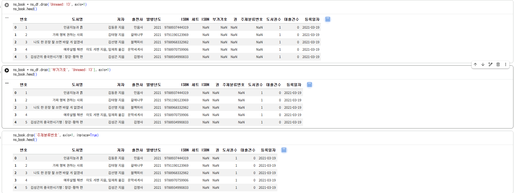
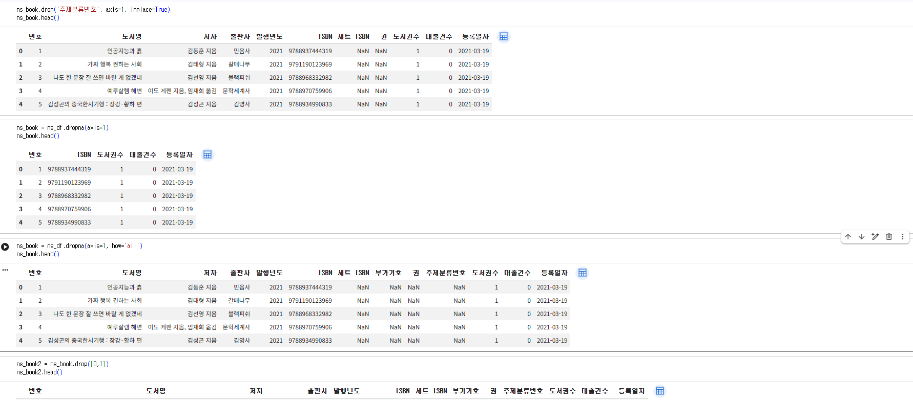
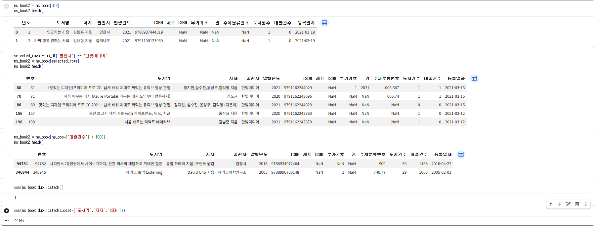
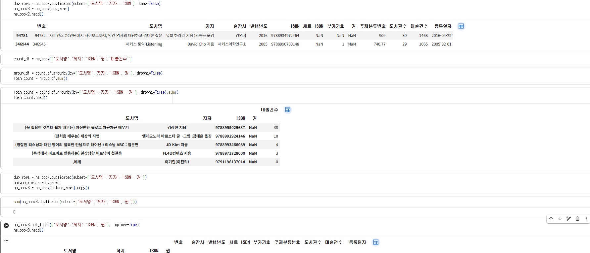

# 데이터분석 3주차 정규과제

📌데이터분석 정규과제는 매주 정해진 분량의 『*혼자 공부하는 데이터 분석 with 파이썬*』 을 읽고 학습하는 것입니다. 이번 주는 아래의 **DataAnalysis_3rd_TIL**에 나열된 분량을 읽고 공부하시면 됩니다.

아래의 문제를 풀어보며 학습 내용을 점검하세요. 문제를 해결하는 과정에서 개념을 스스로 정리하고, 필요한 경우 제시된 강의를 참고하여 보완하는 것이 좋습니다.

<!-- 강의 링크는 아래와 같습니다.
https://www.youtube.com/watch?v=CE3_InvbmLY&list=PLVsNizTWUw7FGzSRCkQrPEEe-ljVXgS7k&index=6
https://www.youtube.com/watch?v=hhbzUEQWdTg&list=PLVsNizTWUw7FGzSRCkQrPEEe-ljVXgS7k&index=7
-->


## DataAnalysis_3rd_TIL

### 3장 데이터 정제하기
#### 01. 불필요한 데이터 삭제하기
#### 02. 잘못된 데이터 수정하기


## Study Schedule

| 주차  | 공부 범위     | 완료 여부 |
| ----- | ------------- | --------- |
| 1주차 | p.24~81    | ✅         |
| 2주차 | p.84~151   | ✅         |
| 3주차 | p.154~219  | ✅         |
| 4주차 | p.222~279 | 🍽️         |
| 5주차 | p.282~325 | 🍽️         |
| 6주차 | p.328~379 | 🍽️         |
| 7주차 | p.382~430 | 🍽️         |

<br>

<!-- 여기까진 그대로 둬 주세요-->


# 1️⃣ 개념 정리 

## 01. 불필요한 데이터 삭제하기

#### 필요 없는 열 삭제하기
- drop() 메서드에 열 이름을 넣고 axis=1을 지정해 열을 지운다. 지울 열이 여러 개라면 리스트(['열1', '열2'])로 묶어 전달한다.
- 연속된 열을 골라낼 때는 df.loc[:, '시작열':'끝열']처럼 슬라이싱을 쓴다. 반대로 특정 열만 쏙 빼고 싶을 때는 df.columns != '제외할열'과 같이 불리언 배열을 만들어 loc에 넘겨주는 방식이 유용하다. 
- 결측치가 섞인 열은 dropna(axis=1)로 없앤다. 열 전체가 비어 있는 경우만 골라 삭제할 때는 how='all'을 추가한다.

#### 필요 없는 행 삭제하기
- 특정 행 번호를 지울 때는 df.drop([0, 1])처럼 인덱스를 지정한다 (axis=0 기본값).
- 실제 분석에서는 특정 조건을 만족하는 데이터만 남기는 불리언 인덱싱을 훨씬 자주 쓴다. 예를 들어 df[df['대출건수'] > 1000]처럼 대괄호 안에 조건을 직접 넣어 원하는 행만 추려낸다.

#### 중복 데이터 처리하기
- duplicated()는 중복된 행을 찾아 불리언 배열로 알려준다. 특정 열 기준으로만 중복을 잡고 싶다면 subset=['도서명', '저자', 'ISBN'] 옵션을 준다.
- 중복 행을 완전히 지울 때는 drop_duplicates()를 사용한다.
- 같은 책의 권수처럼 중복 행의 수치를 합쳐야 할 때는 groupby().sum()을 쓴다. 이때 기준 열에 결측치가 있어 누락되는 것을 막기 위해 dropna=False를 지정하고 합산된 결과를 update() 메서드로 원본 데이터에 반영한다.  

## 02. 잘못된 데이터 수정하기

#### 결측치(NaN) 다루기
- 데이터프레임 전체 구조와 결측치 현황은 info()로 훑어보고 열별 빈 값 개수는 isna().sum()으로 빠르게 센다.
- 정수형 열에 빈 값(NaN)이 들어가면 판다스가 이를 실수형으로 자동 변환해버린다. 따라서 값을 채운 뒤에는 astype()을 사용해 원래 정수 타입으로 되돌려주는 작업이 필요하다.
- 결측치를 채울 때는 fillna('대체값')을 쓰고 일반적인 값 수정까지 한 번에 처리하려면 replace(원래값, 바꿀값)를 사용한다.

#### 정규표현식으로 잘못된 문자열 고치기
- 연도에 '1988.'처럼 마침표가 붙거나 대괄호가 섞여 있으면 숫자로 타입 변환이 안 되고 에러가 난다.
- 이때 정규표현식(regex=True)을 활용해 r'.*(\d{4}).*' 패턴으로 4자리 숫자만 추출해 정상 연도로 교정한다.
- 저자 열에서 (지은이), (옮긴이) 같은 불필요한 라벨을 떼어낼 때도 패턴을 그룹으로 묶어 필요한 이름만 남길 수 있다.
- 정규식으로도 살릴 수 없는 이상한 값(예: '[발행년 불명]')은 우선 -1 같은 약속된 숫자로 바꿔둔다.

#### 비상식적인 수치 이상치 교정
- gt()(초과), lt()(미만) 같은 비교 메서드를 써서 범위 밖 데이터를 잡아낸다.
- 연도가 4000이 넘는 데이터는 단기로 적힌 것이므로 2333을 빼서 서기 연도로 바로잡는다. 여전히 4000이 넘거나 1900년 이전의 터무니없는 값은 오류로 보고 -1로 처리한다.  

#### 외부 데이터 보충 및 전처리 자동화
- 책 제목이나 출판사 같은 필수 정보가 비어 있다면 ISBN을 기반으로 외부 도서 사이트를 크롤링해 누락된 값을 채운다.
- 끝까지 채워지지 않은 결측치나 -1로 남겨둔 행은 데이터 왜곡을 막기 위해 dropna(subset=[...]) 등으로 최종 삭제한다.
- 이 정제 과정 전체를 함수(data_cleaning(), data_fixing())로 묶어두면 새로운 데이터가 들어와도 코드 재사용이 수월하다.  

# 2️⃣ 수행 인증








<br>
<br>

# 3️⃣ 확인 문제

## 문제 1.

> **🧚Q. 다음 두 데이터프레임 df1, df2를 합쳐서 데이터프레임 df3를 만들려고 합니다.**  
> 적절한 판다스 명령을 선택해주세요.

<table>
<tr>

<td>

### df1

| index | col1 | col2 |
|-------|------|------|
| 0     | x    | 5    |
| 1     | y    | 6    |
| 2     | z    | 7    |

</td>

<td>

### df2

| index | col3 | col4 |
|-------|------|------|
| 0     | x    | 50   |
| 1     | y    | 60   |
| 2     | w    | 70   |

</td>

<td align="center" valign="middle">

<h2> ➜ </h2>

</td>

<td>

### df3 (결과)

| index | col1 | col2 | col3 | col4 |
|-------|------|------|------|------|
| 0     | x    | 5.0  | x    | 50.0 |
| 1     | y    | 6.0  | y    | 60.0 |
| 2     | z    | 7.0  | NaN  | NaN  |
| 3     | NaN  | NaN  | w    | 70.0 |

</td>

</tr>
</table>

```
1️⃣ pd.merge(df1, df2)
2️⃣ pd.merge(df1, df2, how='left')
3️⃣ pd.merge(df1, df2, left_on='col1', right_on='col3', how='outer')
4️⃣ pd.merge(df1, df2, left_on='col1', right_on='col3', how='inner')
```

정답: 3️⃣번 (pd.merge(df1, df2, left_on='col1', right_on='col3', how='outer'))

이유: 두 테이블을 보면 열 이름이 완전히 달라서 컴퓨터가 알아서 짝을 못 맞춘다. 그래서 col1과 col3의 알파벳을 기준으로 합치라고 left_on='col1', right_on='col3'을 직접 적어줘야 한다. 그리고 결과인 df3를 보면 양쪽에 다 있는 x, y는 물론이고 한쪽에만 있는 z와 w까지 다 들어가 있다. 없는 짝은 그냥 NaN으로 채워져 있는데 이렇게 버리는 거 없이 양쪽 데이터를 다 살려서 합치는 방식이 바로 outer 조인이다. 그래서 3번이 정답이다.


### 🎉 수고하셨습니다.
