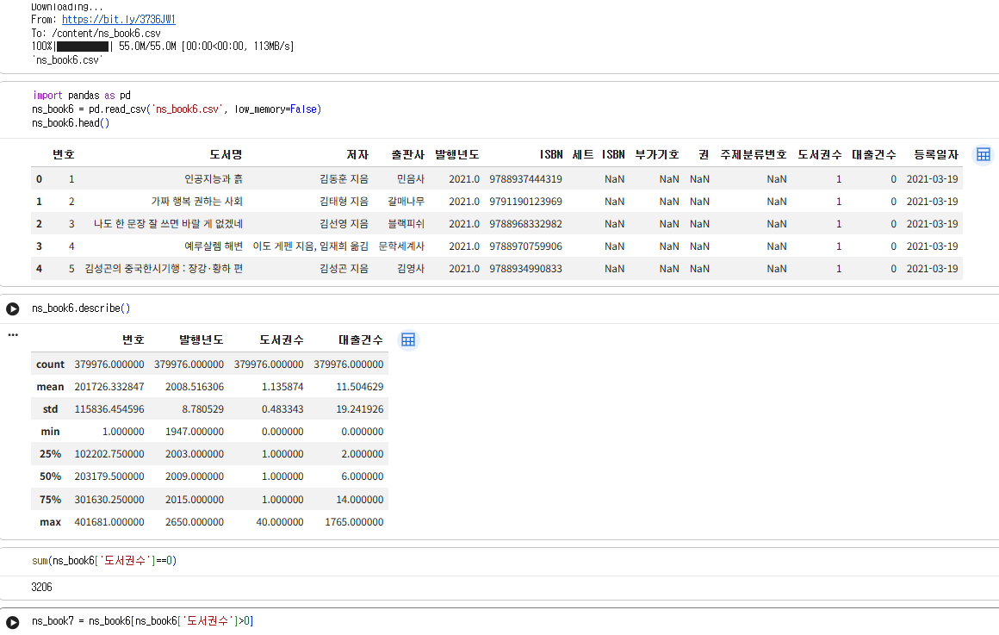
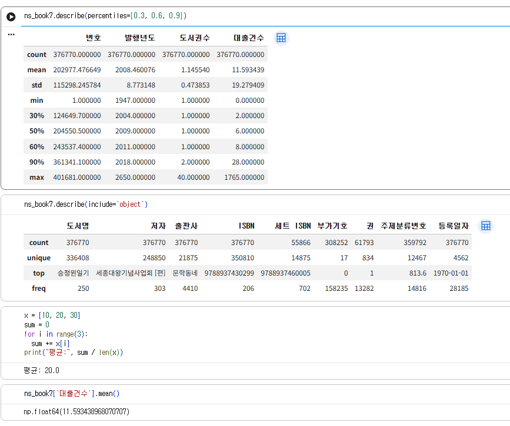
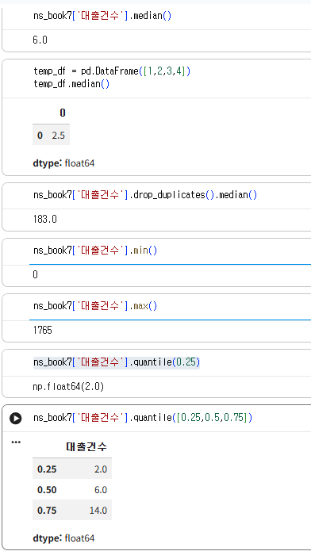

# 데이터분석 4주차 정규과제

📌데이터분석 정규과제는 매주 정해진 분량의 『*혼자 공부하는 데이터 분석 with 파이썬*』 을 읽고 학습하는 것입니다. 이번 주는 아래의 **DataAnalysis_4th_TIL**에 나열된 분량을 읽고 공부하시면 됩니다.

아래의 문제를 풀어보며 학습 내용을 점검하세요. 문제를 해결하는 과정에서 개념을 스스로 정리하고, 필요한 경우 제시된 강의를 참고하여 보완하는 것이 좋습니다.

<!-- 강의 링크는 아래와 같습니다.
https://www.youtube.com/watch?v=HNlRYQnLkek&list=PLVsNizTWUw7FGzSRCkQrPEEe-ljVXgS7k&index=8
https://www.youtube.com/watch?v=Cbk_tQtuhbM&list=PLVsNizTWUw7FGzSRCkQrPEEe-ljVXgS7k&index=9
-->

## DataAnalysis_4th_TIL

### 4장 데이터 요약하기
#### 01. 통계로 요약하기
#### 02. 분포 요약하기

## Study Schedule

| 주차  | 공부 범위     | 완료 여부 |
| ----- | ------------- | --------- |
| 1주차 | p.24~81    | ✅         |
| 2주차 | p.84~151   | ✅         |
| 3주차 | p.154~219  | ✅         |
| 4주차 | p.222~279 | ✅         |
| 5주차 | p.282~325 | 🍽️         |
| 6주차 | p.328~379 | 🍽️         |
| 7주차 | p.382~430 | 🍽️         |

 

<!-- 여기까진 그대로 둬 주세요-->

# 1️⃣ 개념 정리 

## 01. 통계로 요약하기

#### 데이터가 너무 많으면 숫자를 그냥 보는 것만으로는 특징을 파악하기 힘들어서, 전체 데이터를 몇 개의 대표 숫자로 요약하는 기술통계(요약통계)를 사용한다는 걸 배웠다.

###### 1. 기본적인 통계량 한눈에 보기 (describe())
- 판다스의 describe()를 쓰면 개수(count), 평균(mean), 표준편차(std), 최솟값(min), 최댓값(max), 사분위수(25%, 50%, 75%)를 한 번에 싹 뽑아줘서 전체적인 흐름을 보기 편하다.
- 문자열 데이터도 include='object' 옵션을 주면 고유값 개수(unique)나 가장 많이 나온 값(top), 등장 횟수(freq)를 요약해 준다.  

###### 2. 평균과 중앙값
- 평균 (mean): 다 더해서 개수로 나눈 값이다. 값이 튀는 극단적인 이상치가 있으면 평균이 확 끌려 올라가거나 내려갈 수 있다.
- 중앙값 (median): 데이터를 크기 순서대로 줄 세웠을 때 딱 가운데에 있는 값이다 (짝수 개면 가운데 두 개 평균). 대출건수처럼 이상치가 큰 데이터는 평균보다 중앙값이 실제 데이터 형태를 더 잘 보여준다.

###### 3. 분위수 (quantile)와 백분위
- 데이터를 순서대로 늘어놓고 균등하게 나눈 기준점인데 4등분한 사분위수(25%, 50%, 75%)를 가장 많이 쓴다.
- 데이터 사이에 딱 떨어지지 않는 위치는 interpolation(보간) 방식으로 값을 알아서 계산해 준다.

###### 4. 분산과 표준편차 (var, std)
- 데이터들이 평균에서 얼마나 멀리 퍼져 있는지를 나타내는 수치다.
- 분산은 (값 - 평균)²의 평균이라 단위가 커져서 보기 불편한데 여기에 루트를 씌운 게 표준편차다. 원래 데이터와 단위가 같아서 해석하기 훨씬 편하다.
- 주의할 점: 판다스는 표본을 바탕으로 모집단을 추정하려고 분모를 n-1로 나누고 넘파이는 그냥 n으로 나눠서 기본 계산 결과에 미세한 차이가 난다.   

###### 5. 최빈값 (mode)
- 제일 많이 등장한 값이다. 숫자뿐만 아니라 가장 많이 빌려 간 도서명이나 출판사 같은 문자열 데이터 확인할 때 유용하다.

## 02. 분포 요약하기

#### 숫자로만 요약하면 한눈에 어떤 모양인지 감이 잘 안 올 때가 많은데, 시각화(그래프)를 쓰면 데이터의 분포와 특징을 직관적으로 확인할 수 있다는 걸 배웠다. 주로 matplotlib.pyplot(plt)과 판다스의 내장 plot 기능을 활용했다.

###### 1. 산점도 (scatter)
- 가로(x), 세로(y) 좌표축에 점을 콕콕 찍어서 두 변수 사이의 관계를 보는 그래프다.
- 데이터가 너무 빽빽하게 겹쳐서 까맣게 뭉칠 때는 alpha 매개변수로 투명도를 조절해 주면 어디에 데이터가 몰려 있는지 훨씬 잘 보인다.
- x축 값이 커질 때 y축도 같이 커지면 양의 상관관계가 있다는 걸 한눈에 파악할 수 있다. 

###### 2. 히스토그램 (hist)
- 데이터 구간을 일정한 간격으로 나누고 그 구간 안에 데이터가 몇 개 들어있는지 막대 높이로 보여주는 그래프다.
- 한쪽 구간에만 데이터가 몰려 있고 나머지는 너무 작아서 안 보일 때는 yscale('log')처럼 로그 스케일을 적용하면 큰 값과 작은 값의 차이가 줄어들어 숨은 분포를 보기 편해진다.  

###### 3. 상자 수염 그림 (boxplot)
- 최솟값, 1사분위수(25%), 중앙값(50%), 3사분위수(75%), 최댓값의 5가지 숫자로 상자와 수염을 그려서 분포를 보여준다.
- 상자 길이(IQR, 25%~75% 사이 거리)의 1.5배 범위를 벗어나는 데이터는 점으로 따로 찍어주는데 이게 바로 이상치(outlier)다.
- 여러 열의 분포나 쏠림 정도, 이상치 존재 여부를 한눈에 비교하기에 정말 좋다.
- 가로로 눕혀서 보고 싶으면 vert=False 옵션을 주면 된다.

# 2️⃣ 수행 인증

 
 

# 3️⃣ 확인 문제

## 문제 1.

> **🧚Q. 이번 주차에는 확인문제 대신 실습 과제를 진행합니다. 캐글에서 원하는 데이터셋을 선택하여 기술통계를 계산하고, 다양한 시각화를 수행해보세요.
작업은 코랩에서 진행한 뒤, 코랩 링크를 아래에 첨부해주세요.**

https://colab.research.google.com/drive/1YvbWB5a-QKoiOkPGh6v0A_goCY1SyS1K?usp=sharing

### 🎉 수고하셨습니다.
