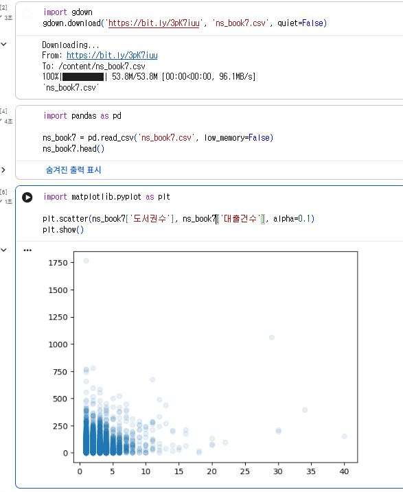
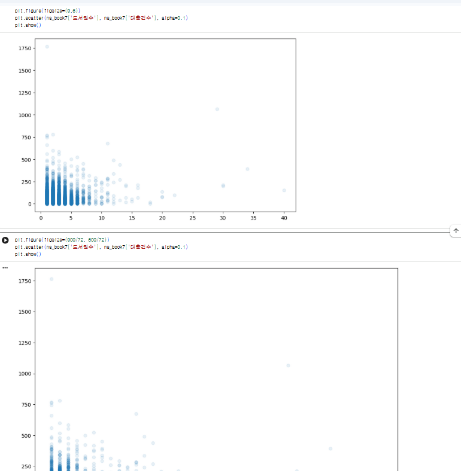
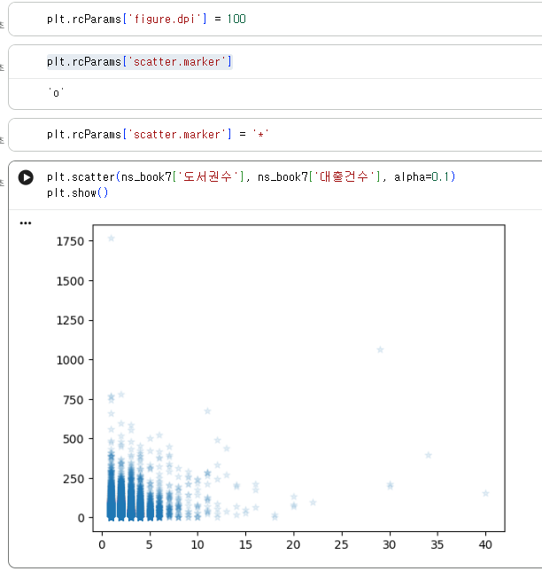
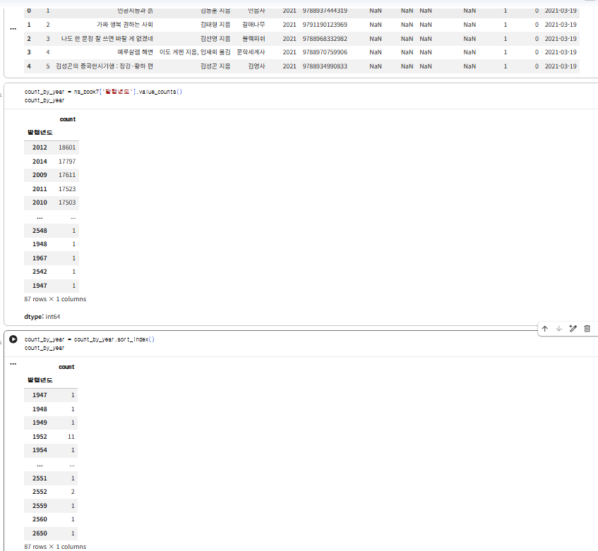
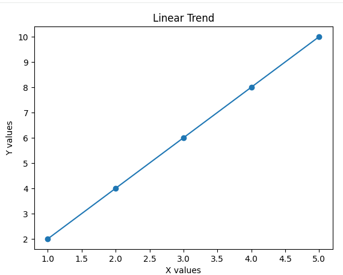

# 데이터분석 5주차 정규과제

📌데이터분석 정규과제는 매주 정해진 분량의 『*혼자 공부하는 데이터 분석 with 파이썬*』 을 읽고 학습하는 것입니다. 이번 주는 아래의 **DataAnalysis_5th_TIL**에 나열된 분량을 읽고 공부하시면 됩니다.

아래의 문제를 풀어보며 학습 내용을 점검하세요. 문제를 해결하는 과정에서 개념을 스스로 정리하고, 필요한 경우 제시된 강의를 참고하여 보완하는 것이 좋습니다.

<!-- 강의 링크는 아래와 같습니다.
https://www.youtube.com/watch?v=ho0LZ6GWhtc&list=PLVsNizTWUw7FGzSRCkQrPEEe-ljVXgS7k&index=10
https://www.youtube.com/watch?v=deYY4xHsI0o&list=PLVsNizTWUw7FGzSRCkQrPEEe-ljVXgS7k&index=11
-->


## DataAnalysis_5th_TIL

### 5장 데이터 시각화하기
#### 01. 맷플롯립 기본 요소 알아보기
#### 02. 선 그래프와 막대 그래프 그리기


## Study Schedule

| 주차  | 공부 범위     | 완료 여부 |
| ----- | ------------- | --------- |
| 1주차 | p.24~81    | ✅         |
| 2주차 | p.84~151   | ✅         |
| 3주차 | p.154~219  | ✅         |
| 4주차 | p.222~279 | ✅         |
| 5주차 | p.282~325 | ✅         |
| 6주차 | p.328~379 | 🍽️         |
| 7주차 | p.382~430 | 🍽️         |

<br>

<!-- 여기까진 그대로 둬 주세요-->


# 1️⃣ 개념 정리 

## 01. 맷플롯립 기본 요소 알아보기

- Figure & DPI: plt.figure(figsize=(너비, 높이))로 크기를 지정하며 dpi를 키우면 글자·마커 등 내부 요소도 함께 확대됨

- rcParams: 그래프 기본 설정을 바꾸는 전역 객체 (예: plt.rcParams['figure.dpi'] = 100, plt.rcParams['scatter.marker'] = '*')

- subplots: fig, axs = plt.subplots(행, 열)로 여러 그래프를 한 번에 생성 (예: plt.subplots(1, 2)는 가로 2칸)

- Axes 메서드: 개별 서브플롯 조작 시 set_title(), set_xlabel(), set_ylabel(), set_yscale('log') 사용   

## 02. 선 그래프와 막대 그래프 그리기

- 데이터 정렬: 시간순 추세를 볼 때는 sort_index()로 x축을 오름차순 정렬 후 그림   

- 선 그래프: linestyle('-', ':' 등), marker, color 설정 가능하며 '*-g'처럼 축약 포맷 사용 가능   

- 막대 그래프: 세로 막대는 plt.bar(x, y, width=0.7), 가로 막대는 plt.barh(y, x, height=0.7) 사용   

- 값 표시: plt.annotate(텍스트, 좌표, xytext=(dx, dy), textcoords='offset points')로 마커/막대 옆에 값 표기 (가운데 정렬: 세로 ha='center', 가로 va='center')   

- 눈금 조절: plt.xticks(range(시작, 끝, 간격))로 축 눈금 단위 설정   

- 이미지 & 저장: plt.imshow()로 이미지 출력, plt.savefig('파일명.png')로 그래프를 이미지 파일로 저장 (plt.show() 전에 실행)   

# 2️⃣ 수행 인증






# 3️⃣ 확인 문제

## 문제 1.

> **🧚Q. 다음 데이터를 이용하여 matplotlib으로 선그래프를 그리는 코드를 작성해주세요.**
- x = [1, 2, 3, 4, 5]
- y = [2, 4, 6, 8, 10]
> 조건은 아래와 같습니다.
```
1️⃣ 제목은 "Linear Trend"로 설정해주세요.
2️⃣ x축 이름은 "X values"로 설정해주세요.
3️⃣ y축 이름은 "Y values"로 설정해주세요.
4️⃣ 마커(marker)를 포함하여 선그래프를 그려주세요.
```

import matplotlib.pyplot as plt

# 데이터 정의
x = [1, 2, 3, 4, 5]
y = [2, 4, 6, 8, 10]

# 마커(marker='o')를 포함한 선그래프 그리기
plt.plot(x, y, marker='o')

# 제목 설정
plt.title("Linear Trend")

# x축 이름 설정
plt.xlabel("X values")

# y축 이름 설정
plt.ylabel("Y values")

plt.show()




### 🎉 수고하셨습니다.
