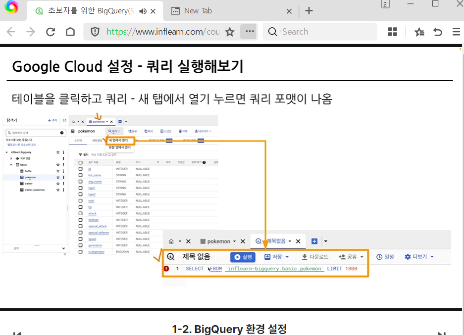

# 📘 SQL_BASIC 1주차 정규 과제

SQL_BASIC 정규 과제는 매주 정해진 분량의 `초보자를 위한 BigQuery(SQL) 입문` 강의를 듣고, 핵심 개념을 정리한 뒤 간단한 SQL 문제를 직접 풀어보는 방식으로 진행합니다.

이번 주는 BigQuery 환경과 SQL의 기본 구조를 익히고, 데이터가 어떤 형태로 저장되고 활용되는지 생각해봅니다.

완성된 과제는 Github에 업로드하고, 링크를 스프레드시트 'SQL' 시트에 입력해 제출해주세요.

**👀 수행 인증란은 필수입니다.**

---

## 📚 SQL_BASIC_1st_TIL

### 섹션 2. BigQuery 기초 지식

### 1-1. BigQuery 기초 지식

### 1-2. BigQuery 환경 설정

### 섹션 3. 데이터 탐색 - 조건, 추출, 요약

### 2-1. 데이터 활용 Overview

---

## ✨ 선택 강의

- 1. 강의 소개 & 상황별 추천 수강 방법 미리보기: 강의 전체 구성과 수강 방향을 확인하고 싶을 때 선택 수강

---

## 🏁 전체 강의 수강 계획

| 주차 | 필수 강의 범위 | 선택 강의 | 완료 여부 |
| --- | --- | --- | --- |
| 1주차 | 1-1 ~ 2-1 | 1 | ✅ |
| 2주차 | 2-2 ~ 2-3 | 2-4 | 🍽️ |
| 3주차 | 2-5, 2-7 ~ 2-8 | 2-6 | 🍽️ |
| 4주차 | 3-2 ~ 4-3 | 3-4 | 🍽️ |
| 5주차 | 4-4 ~ 4-6 | 4-5, 4-7 | 🍽️ |
| 6주차 | 5-2 ~ 5-5 | 5-6 | 🍽️ |
| 7주차 | 필수 강의 없음 | 6-2, 6-3, 6-4, 6-5 | 🍽️ |

---

<br>

<!-- 여기까진 그대로 둬 주세요-->

---

# 1️⃣ 개념 정리

아래 키워드 중 중요하다고 생각한 개념을 2개 이상 골라 짧게 정리해주세요. 3개보다 더 많이 정리하고 싶다면 자유롭게 항목을 추가해도 좋습니다.

이번 주 키워드:
- SQL
- BigQuery
- Database
- Table
- Row
- Column
- 데이터 활용 과정

## 01.

```
개념 이름: SQL (Structured Query Language)
개념 설명: 데이터베이스에 저장된 수많은 데이터와 대화하기 위해 사용하는 컴퓨터 언어이다. 데이터를 새롭게 추가하거나 수정하며 원하는 조건의 데이터만 골라서 추출할 때 명령을 내리는 역할을 한다.
활용 상황: 대용량 쇼핑몰 주문 내역 중 지난달 특정 상품을 구매한 고객 명단처럼 필요한 조건의 데이터만 빠르게 조회하고 가져올 때 활용한다.
```

## 02.

```
개념 이름: BigQuery (빅쿼리)
개념 설명: 구글 클라우드(Google Cloud)에서 제공하는 대용량 데이터 저장 및 분석 서비스이다. 개인 컴퓨터의 성능과 관계없이 웹상에서 방대한 양의 데이터를 순식간에 SQL로 조회하고 분석할 수 있도록 지원한다.
활용 상황: 엑셀로는 파일 용량이 너무 커서 열리지 않거나 멈춰버리는 대규모 접속 로그나 결제 데이터를 불러와 신속하게 분석할 때 활용한다.
```

## (선택) 03.

```
개념 이름: Table (테이블)과 Row / Column (행과 열)
개념 설명: 데이터를 표 형태로 체계적으로 정리해 둔 공간이다. 엑셀의 표처럼 Row은 개별 데이터 한 건(EX 특정 회원 정보), Column은 데이터의 고유한 항목이나 속성(EX 이름, 나이, 전화번호)을 의미한다.
활용 상황: 고객 정보 데이터베이스에서 특정 '나이(Column)'를 만족하는 고객 '한 명 한 명의 정보(Row)'를 찾아내기 위해 데이터의 위치와 구조를 파악할 때 활용한다.
```

---

# 2️⃣ 수행 인증란

아래 중 하나 이상을 첨부해주세요.

- 강의 수강 화면 캡처
- 이번 주 학습 내용을 정리한 노트 캡처


---

# 3️⃣ 확인 문제

## 🧩 문제 1

포켓몬 게임이나 이커머스 산업과 같이 다양한 산업에서는 각기 다른 데이터가 존재합니다. 다음 중 하나의 산업을 선택하고, 해당 산업에서 수집하고 활용될 수 있는 데이터 항목, 즉 컬럼 5가지를 자유롭게 상상하여 나열해주세요.

예시 산업:
- 온라인 음식 배달
- 스마트 헬스 케어
- 중고 거래 앱
- 교육 플랫폼

풀이 과정:

```
- 선택한 산업:
온라인 뷰티/화장품 커머스

- 떠올린 컬럼 5가지:
1. 피부_타입
2. 피부_고민
3. 구매_제품명
4. 재구매_여부
5. 제품_평점

- 해당 컬럼이 필요하다고 생각한 이유:
1. 피부_타입: 건성, 지성, 복합성, 민감성 등 고객 개개인의 피부 특성을 파악하여 맞춤형 스킨케어 제품을 개인화 추천하는 데 필요하다.
2. 피부_고민: 트러블, 모공, 탄력, 미백 등 고객이 해결하고자 하는 구체적인 니즈를 분류하고 시즌별(환절기 보습, 여름철 진정 등) 기획전을 구성하는 데 활용할 수 있다.
3. 구매_제품명: 어떤 카테고리(스킨, 앰플, 크림 등)와 특정 브랜드 제품이 가장 많이 팔리는지 베스트셀러 트렌드를 추적하고 재고를 관리하는 데 필수적이다.
4. 재구매_여부: 화장품은 소모품인 만큼 고객이 한 번 써보고 마음에 들어 다시 사는지 확인하여 제품 충성도와 브랜드 신뢰도를 측정하는 핵심 지표가 된다.
5. 제품_평점: 발림성이나 실제 사용 후기 만족도를 정량적으로 확인하여 품질에 문제가 있는 상품을 가려내고 신규 고객의 구매 결정을 유도하는 데 도움이 되기 때문이다.
```

## 🧩 문제 2

이번 강의를 통해 SQL이 왜 필요하다고 느끼는지, SQL을 통해 본인이 어떤 것을 해내고 싶은지를 자유롭게 작성해주세요.

풀이 과정:

```
- SQL이 필요하다고 느낀 이유:
데이터 양이 조금만 많아져도 엑셀 같은 프로그램으로는 열어보거나 정리하기가 너무 무겁고 느려지는데, SQL을 쓰면 수많은 데이터 속에서 내가 딱 보고 싶은 내용만 빠르고 깔끔하게 추려낼 수 있어서 꼭 필요하다고 느꼈다.

- SQL로 해보고 싶은 일:
나중에 큰 규모의 실제 데이터를 마주했을 때 겁먹지 않고, 내가 궁금한 조건을 직접 쿼리로 짜서 원하는 데이터만 쏙쏙 뽑아내 분석해보고 싶다.

- 앞으로 SQL을 공부할 때 기대되는 점:
지금은 버튼 누르는 것이나 화면 자체가 낯설지만, 문법을 하나씩 배우면서 긴 데이터 목록이 내가 짠 명령어 한 줄로 정리되어 나오는 재미를 느낄 수 있을 것 같아 기대된다.
```

---

# 4️⃣ 이번 주 회고

```
1. SQL을 처음 써보면서 가장 낯설었던 점:
보통 코딩하면 검은 창이나 코드 편집기부터 켤 줄 알았는데 구글 클라우드라는 낯선 사이트에 들어가서 권한이나 프로젝트 같은 작업 공간부터 하나씩 파야 했던 게 생각보다 어색했다.

2. 다음 주에 더 익숙해지고 싶은 부분:
콘솔 창에서 쿼리 치고 결과 확인하는 작업 손놀림을 좀 더 빠르게 만들고 싶다. 엑셀이나 다른 툴이랑 다르게 SQL은 데이터를 어떤 방식으로 생각하고 뽑아오는지 그 고유한 규칙을 빨리 머리에 익히는 게 목표이다.

3. 과제 진행 중 막혔던 부분이 있다면:
데이터셋을 올려두고 막상 쿼리를 돌렸을 때, 테이블 이름을 어떻게 불러와야 하는지나 실행 버튼 누른 뒤 결과를 확인하는 순서가 익숙하지 않아 몇 번 다시 확인하느라 애를 먹었다.
```

수고하셨습니다!


