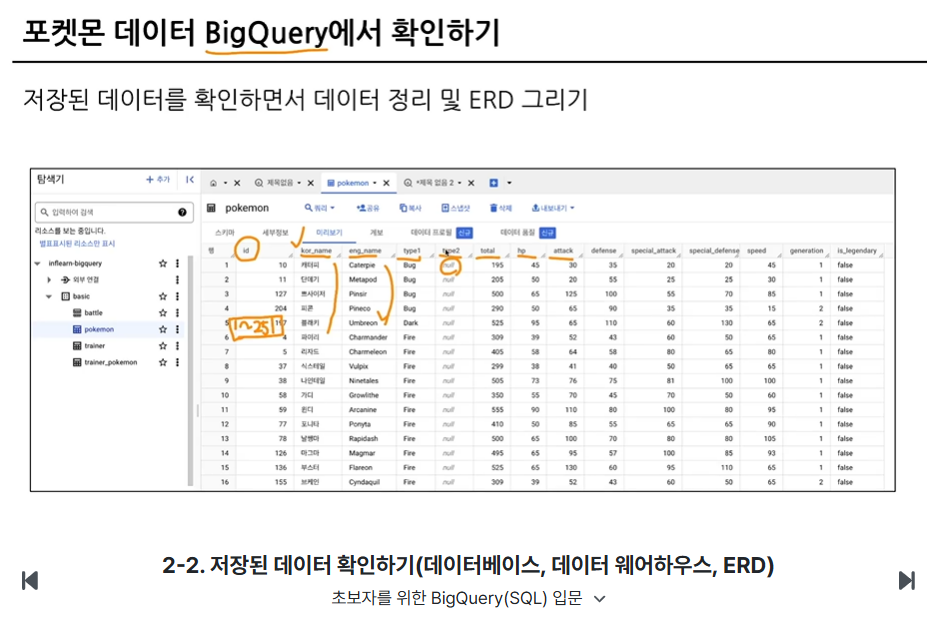
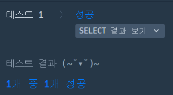
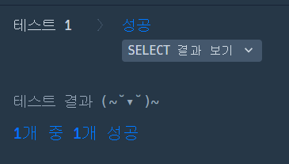

# 📘 SQL_BASIC 2주차 정규 과제

SQL_BASIC 정규 과제는 매주 정해진 분량의 `초보자를 위한 BigQuery(SQL) 입문` 강의를 듣고, 핵심 개념을 정리한 뒤 간단한 SQL 문제를 직접 풀어보는 방식으로 진행합니다.

이번 주는 저장된 데이터를 확인하는 방법과 `SELECT`, `FROM`, `WHERE`의 기본 구조를 학습합니다.

완성된 과제는 Github에 업로드하고, 링크를 스프레드시트 'SQL' 시트에 입력해 제출해주세요.

**👀 수행 인증란은 필수입니다.**

---

## 📚 SQL_BASIC_2nd_TIL

### 섹션 3. 데이터 탐색 - 조건, 추출, 요약

### 2-2. 저장된 데이터 확인하기(데이터베이스, 데이터 웨어하우스, ERD)

### 2-3. 데이터 탐색(SELECT, FROM, WHERE)

---

## ✨ 선택 강의

- 2-4. SELECT 연습 문제: SELECT, FROM, WHERE를 더 연습하고 싶을 때 선택 수강

---

## 🏁 전체 강의 수강 계획

| 주차 | 필수 강의 범위 | 선택 강의 | 완료 여부 |
| --- | --- | --- | --- |
| 1주차 | 1-1 ~ 2-1 | 1 | ✅ |
| 2주차 | 2-2 ~ 2-3 | 2-4 | ✅ |
| 3주차 | 2-5, 2-7 ~ 2-8 | 2-6 | 🍽️ |
| 4주차 | 3-2 ~ 4-3 | 3-4 | 🍽️ |
| 5주차 | 4-4 ~ 4-6 | 4-5, 4-7 | 🍽️ |
| 6주차 | 5-2 ~ 5-5 | 5-6 | 🍽️ |
| 7주차 | 필수 강의 없음 | 6-2, 6-3, 6-4, 6-5 | 🍽️ |

---

<br>

<!-- 여기까진 그대로 둬 주세요-->

---

# 1️⃣ 개념 정리

아래 키워드 중 중요하다고 생각한 개념을 2개 이상 골라 짧게 정리해주세요. 3개보다 더 많이 정리하고 싶다면 자유롭게 항목을 추가해도 좋습니다.

이번 주 키워드:
- SELECT
- FROM
- WHERE
- 조건식
- ORDER BY
- LIMIT
- 테이블 구조 확인

## 01.

```
개념 이름: SELECT
개념 설명: 가져오고 싶은 컬럼들을 지정한다. (Col1 AS new_name처럼 AS를 사용하면 Col1의 이름이 new_name으로 컬럼이름이 변경된다.)
예시 쿼리: SELECT name, salary (기본형: SELECT 컬럼명1, 컬럼명2)
```

## 02.

```
개념 이름: FROM
개념 설명: 데이터를 조회할 위치(데이터셋.테이블)를 지정한다.
예시 쿼리: FROM company.employees (기본형: FROM 데이터셋명.테이블명)
```

## (선택) 03.

```
개념 이름: WHERE
개념 설명: 가져올 데이터의 조건을 지정한다.
예시 쿼리: WHERE department = 'Sales'; (기본형: WHERE 조건식;)
```

---

# 2️⃣ 수행 인증란


---

# 3️⃣ 확인 문제

프로그래머스는 로그인이 필요하므로, 로그인 후 문제 풀이를 진행해주세요.

## 🧩 문제 1

문제 링크: [모든 레코드 조회하기](https://s  chool.programmers.co.kr/learn/courses/30/lessons/59034)

풀이 과정:

```
- 테이블에서 확인한 컬럼: ANIMAL_INS 테이블의 모든 컬럼(* 사용)
- SELECT와 FROM을 작성한 방식: 모든 동물의 정보를 가져와야 하므로 SELECT *을 사용했고 대상 테이블인 FROM ANIMAL_INS를 지정하여 작성했다.
- 새로 배운 점: 모든 동물의 정보를 가져올 때는 특정 데이터를 골라내는 WHERE 절이 필요 없다는 것을 배웠다. 그리고 특정 기준으로 데이터를 정렬할 때는 ORDER BY라는 새로운 구문을 사용한다는 점을 배웠다.
```



## 🧩 문제 2

문제 링크: [아픈 동물 찾기](https://school.programmers.co.kr/learn/courses/30/lessons/59036)

풀이 과정:

```
- 문제에서 요구한 조건: 동물의 상태(INTAKE_CONDITION)가 'Sick'(아픈 상태)인 동물만 골라내고 동물의 아이디(ANIMAL_ID)와 이름(NAME)만 출력해야 한다.
- WHERE 절로 옮긴 방식: 컬럼과 문자열 값을 비교 연산자(=)로 연결하여 WHERE INTAKE_CONDITION = 'Sick'으로 작성했다.
- 정렬 기준이 있다면 사용한 기준: ANIMAL_ID (동물 아이디) 순으로 조회하라는 조건이 있어서 ORDER BY ANIMAL_ID를 사용해 오름차순으로 정렬했다.
- 새로 배운 점: 전체 데이터를 가져오는 SELECT * 대신 SELECT ANIMAL_ID, NAME처럼 필요한 컬럼만 선택해서 가져오는 법을 배웠다.
```



---

# 4️⃣ 이번 주 회고

```
1. SELECT, FROM, WHERE 중 가장 헷갈린 개념: FROM 절에서 빅쿼리 형식인 Dataset.Table 형태처럼 데이터 위치 경로를 정확히 적어주는 부분이 헷갈렸다.
2. 문제를 풀 때 가장 자주 확인하게 된 부분: SELECT - FROM -WHERE 순서인 것을 수시로 다시 확인하게 되었다.
3. 다음 주 문제 풀이에서 의식하고 싶은 습관:
```SELECT, FROM, WHERE의 기본 개념과 사용하는 상황을 조금 더 의식해가며 필요한 상황에 알맞게 쓸 수 있도록 하고 싶다.

수고하셨습니다!


