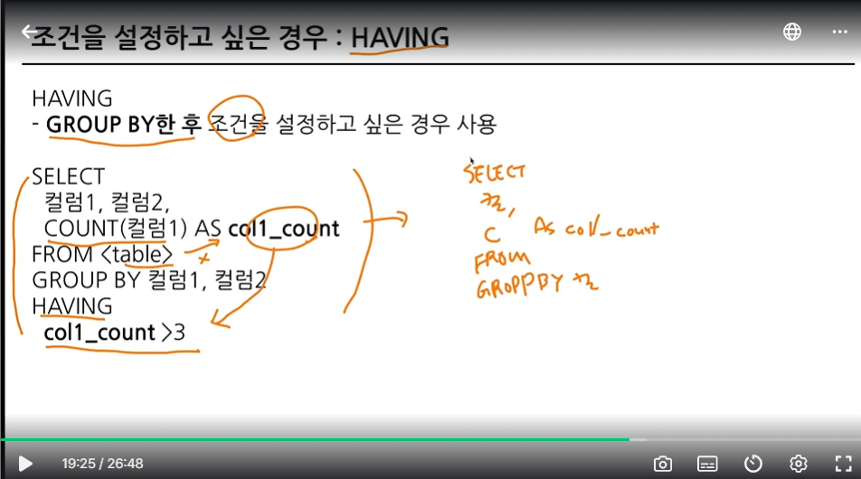
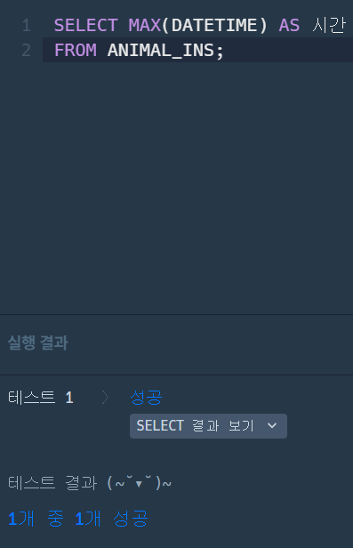
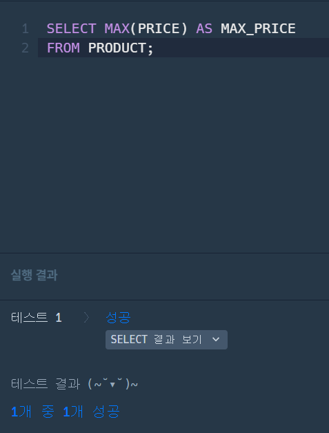
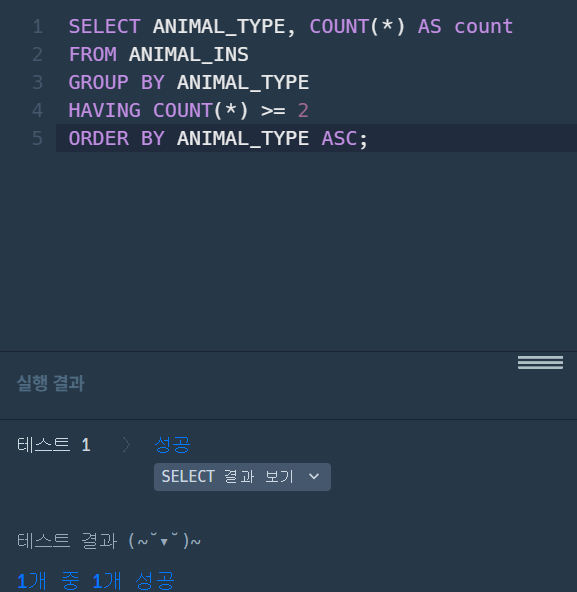

# 📘 SQL_BASIC 3주차 정규 과제

SQL_BASIC 정규 과제는 매주 정해진 분량의 `초보자를 위한 BigQuery(SQL) 입문` 강의를 듣고, 핵심 개념을 정리한 뒤 간단한 SQL 문제를 직접 풀어보는 방식으로 진행합니다.

이번 주는 집계 함수와 `GROUP BY`, `HAVING`을 학습합니다.

완성된 과제는 Github에 업로드하고, 링크를 스프레드시트 'SQL' 시트에 입력해 제출해주세요.

**👀 수행 인증란은 필수입니다.**

---

## 📚 SQL_BASIC_3rd_TIL

### 섹션 3. 데이터 탐색 - 조건, 추출, 요약

### 2-5. 집계(GROUP BY + HAVING + SUM/COUNT)

### 2-7. 정리

### 2-8. 새로운 집계 함수 소개(GROUP BY ALL, 2024-02-26에 나온 함수)

---

## ✨ 선택 강의

- 2-6. 연습 문제: 집계와 조건 조회를 더 연습하고 싶을 때 선택 수강

---

## 🏁 전체 강의 수강 계획

| 주차 | 필수 강의 범위 | 선택 강의 | 완료 여부 |
| --- | --- | --- | --- |
| 1주차 | 1-1 ~ 2-1 | 1 | ✅ |
| 2주차 | 2-2 ~ 2-3 | 2-4 | ✅ |
| 3주차 | 2-5, 2-7 ~ 2-8 | 2-6 | ✅ |
| 4주차 | 3-2 ~ 4-3 | 3-4 | 🍽️ |
| 5주차 | 4-4 ~ 4-6 | 4-5, 4-7 | 🍽️ |
| 6주차 | 5-2 ~ 5-5 | 5-6 | 🍽️ |
| 7주차 | 필수 강의 없음 | 6-2, 6-3, 6-4, 6-5 | 🍽️ |

---

 

<!-- 여기까진 그대로 둬 주세요-->

---

# 1️⃣ 개념 정리

아래 키워드 중 중요하다고 생각한 개념을 2개 이상 골라 짧게 정리해주세요. 3개보다 더 많이 정리하고 싶다면 자유롭게 항목을 추가해도 좋습니다.

이번 주 키워드:
- COUNT
- SUM
- AVG
- MAX
- MIN
- GROUP BY
- HAVING
- 집계 기준

## 01.

개념 이름: GROUP BY
개념 설명: 같은 값끼리 모아서 그룹화할 때 사용한다.
예시 쿼리:
SELECT
  집계할_컬럼1,
  집계 함수(COUNT,MAX,MIN 등)
FROM Table
GROUP BY
  집계할_컬럼1
- 집계할 컬럼을 SELECT에 명시하고 그 컬럼을 꼭 GROUP BY에 작성!

## 02.

개념 이름: HAVING
개념 설명: GROUP BY한 후 조건을 설정할 때 사용한다.
예시 쿼리:
SELECT
  컬럼1, 컬럼2,
  COUNT(컬럼1) AS col1_count
FROM <table>
 GROUP BY 컬럼1, 컬럼2
 HAVING
  col1_count>3

# 2️⃣ 수행 인증란

# 3️⃣ 확인 문제

프로그래머스는 로그인이 필요하므로, 로그인 후 문제 풀이를 진행해주세요.

## 🧩 문제 1

문제 링크: [최댓값 구하기](https://school.programmers.co.kr/learn/courses/30/lessons/59415)

풀이 과정:

- 문제 요구사항: ANIMAL_INS 테이블에서 가장 최근에 동물 보호소에 들어온 동물의 입소 시각(DATETIME)을 조회한다.

- 사용한 SQL 절: SELECT, FROM (MAX 집계 함수 사용)

- 새로 배운 점: DATETIME 형태의 날짜/시간 데이터에서도 MAX() 함수를 사용하면 가장 최신의 날짜와 시간 데이터를 구해낼 수 있다.

## 🧩 문제 2

문제 링크: [가장 비싼 상품 구하기](https://school.programmers.co.kr/learn/courses/30/lessons/131697)

풀이 과정:

- 사용한 집계 함수: MAX()

- 집계 대상 컬럼: PRICE

- 결과를 검증한 방법: MAX(PRICE)를 적용했을 때 테이블 전체에서 가격이 가장 높은 하나의 숫자만 출력되는지 확인했고, 문제 요구사항대로 결과 컬럼의 이름이 MAX_PRICE로 제대로 출력되는지 확인했다.

## 🧩 문제 3

문제 링크: [고양이와 개는 몇 마리 있을까](https://school.programmers.co.kr/learn/courses/30/lessons/59040)

풀이 과정:

- 그룹화 기준: ANIMAL_TYPE (동물 종별로 그룹화)

- WHERE와 HAVING 중 사용한 절: HAVING 절 사용 (HAVING COUNT(*) >= 2; - HAVING 절 사용해 보기위해 직접 추가해본 조건입니다 ㅎ..)

- 처음 틀렸다면 틀린 이유: 틀리진 않았지만 처음에 ORDER BY ANIMAL_TYPE ASC를 사용하지 않아도 고양이가 먼저 조회되긴 했는데 이는 알파벳 순으로 Cat이 Dog보다 앞서기 때문에 자동으로 먼저 조회된 거지만, 만약 알파벳 순으로 뒤 오는 것을 먼저 조회해야 한다면 ORDER BY ANIMAL_TYPE ASC를 꼭 사용해야 한다. 

- 새로 배운 SQL 패턴:
데이터를 끼리끼리 묶은 다음(GROUP BY), 개수가 몇 개 이상인 그룹만 골라내고(HAVING), 마지막으로 보기 좋게 순서대로 정렬(ORDER BY)하는 한 세트 흐름을 배웠다.

---

# 4️⃣ 이번 주 회고

1. 문제를 SQL로 옮길 때 가장 어려웠던 부분: WHERE 절을 먼저 배워서 그나마 더 익숙하다 보니 그룹화된 결과에 조건을 걸 때 WHERE 대신 HAVING을 새로 떠올려서 사용하는 게 가장 헷갈렸던 것 같다.

2. WHERE와 HAVING의 차이를 어떻게 이해했는지: WHERE은 그룹으로 묶기 !!!전!!!에 원본 데이터에서 조건에 맞는 하나하나의 행을 골라내는 절이고 HAVING은 GROUP BY로 묶은 !!!후!!!에 COUNT(*) 같은 그룹 전체의 집계 결과를 가지고 조건을 걸어 골라내는 절이다.

3. 다음 주에 더 연습하고 싶은 문제 유형:
WHERE와 HAVING이 함께 쓰이는 복합 집계 문제 유형을 더 연습해보고 싶다.

수고하셨습니다!

