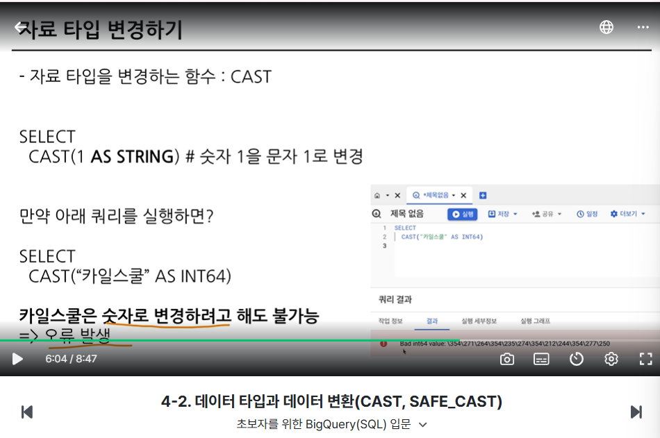
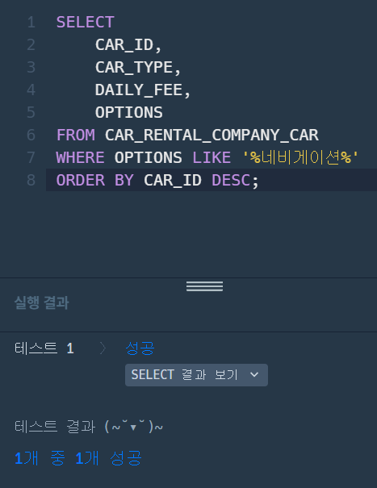
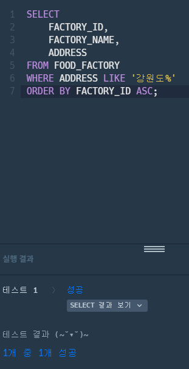
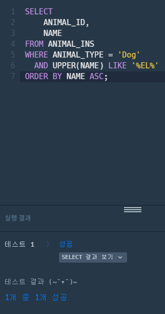
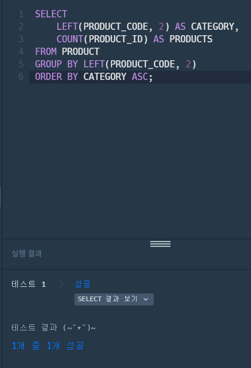

# 📘 SQL_BASIC 4주차 정규 과제

SQL_BASIC 정규 과제는 매주 정해진 분량의 `초보자를 위한 BigQuery(SQL) 입문` 강의를 듣고, 핵심 개념을 정리한 뒤 간단한 SQL 문제를 직접 풀어보는 방식으로 진행합니다.

이번 주는 SQL 쿼리를 작성하는 흐름, 쿼리 작성 템플릿, 데이터 타입 변환, 문자열 함수를 학습합니다.

완성된 과제는 Github에 업로드하고, 링크를 스프레드시트 'SQL' 시트에 입력해 제출해주세요.

**👀 수행 인증란은 필수입니다.**

---

## 📚 SQL_BASIC_4th_TIL

### 섹션 4. SQL 쿼리 잘 작성하기, 쿼리 작성 템플릿 및 오류를 잘 디버깅하기

### 3-2. SQL 쿼리를 작성하는 흐름

### 3-3. 쿼리 작성 템플릿과 생산성 도구

### 섹션 5. 데이터 탐색 - 변환

### 4-1. INTRO

### 4-2. 데이터 타입과 데이터 변환(CAST, SAFE_CAST)

### 4-3. 문자열 함수(CONCAT, SPLIT, REPLACE, TRIM, UPPER)

---

## ✨ 선택 강의

- 3-4. 오류를 디버깅하는 방법: 오류 메시지 해석과 디버깅 흐름을 더 익히고 싶을 때 선택 수강

---

## 🏁 전체 강의 수강 계획

| 주차 | 필수 강의 범위 | 선택 강의 | 완료 여부 |
| --- | --- | --- | --- |
| 1주차 | 1-1 ~ 2-1 | 1 | ✅ |
| 2주차 | 2-2 ~ 2-3 | 2-4 | ✅ |
| 3주차 | 2-5, 2-7 ~ 2-8 | 2-6 | ✅ |
| 4주차 | 3-2 ~ 4-3 | 3-4 | ✅ |
| 5주차 | 4-4 ~ 4-6 | 4-5, 4-7 | 🍽️ |
| 6주차 | 5-2 ~ 5-5 | 5-6 | 🍽️ |
| 7주차 | 필수 강의 없음 | 6-2, 6-3, 6-4, 6-5 | 🍽️ |

---

 

<!-- 여기까진 그대로 둬 주세요-->

---

# 1️⃣ 개념 정리

아래 키워드 중 중요하다고 생각한 개념을 2개 이상 골라 짧게 정리해주세요. 3개보다 더 많이 정리하고 싶다면 자유롭게 항목을 추가해도 좋습니다.

이번 주 키워드:
- 쿼리 작성 순서
- 쿼리 작성 템플릿
- 데이터 타입
- CAST
- SAFE_CAST
- CONCAT
- REPLACE
- TRIM

## 01.
개념 이름: 쿼리 작성 템플릿
개념 설명: 
##### 주석으로 먼저 달기
쿼리를 작성하는 목표, 확인할 지표 :
쿼리 계산 방법
데이터 기간
사용할 테이블
Join KEY
데이터 특징 :
##### 여기까지

SELECT

FROM
WHERE

예시 쿼리:
##### 주석으로 먼저 달기
쿼리를 작성하는 목표, 확인할 지표: 20대 회원 수 파악하기
쿼리 계산 방법: 나이가 20~29세인 회원들의 수 세기 (COUNT)
데이터의 기간: 현재 등록되어 있는 전체 유저 기준
사용할 테이블: users (회원 정보 테이블)
Join KEY: 없음 (테이블 1개만 사용)
데이터 특징: 탈퇴한 회원도 섞여 있어서 status = '정상' 조건 필요
##### 여기까지

SELECT 
    COUNT(*) AS total_20s_users
FROM users
WHERE age BETWEEN 20 AND 29
  AND status = '정상';

## 02.
개념 이름: CAST
개념 설명: 자료 타입을 변경하는 함수
예시 쿼리:
SELECT
  CAST(1 AS STRING) # 숫자 1을 문자 1로 변경

## (선택) 03.

개념 이름: SAFE_CAST
개념 설명: 더 안전하게 데이터 타입 변경하기(SAFE_가 붙은 함수는 변환이 실패할 경우 NULL 반환)
예시 쿼리:
SELECT
  SAFE_CAST("카일스쿨" AS INT46)

-> SELECT
    CAST("카일스쿨" AS INT46) # 카일스쿨은 숫자로 변경하려고 해도 불가능하므로 오류 발생

---

# 2️⃣ 수행 인증란

아래 중 하나 이상을 첨부해주세요.

---

# 3️⃣ 확인 문제

프로그래머스는 로그인이 필요하므로, 로그인 후 문제 풀이를 진행해주세요.

## 🧩 문제 1

문제 링크: [특정 옵션이 포함된 자동차 리스트 구하기](https://school.programmers.co.kr/learn/courses/30/lessons/157343)

풀이 과정:

- 찾으려는 문자열 조건: OPTIONS 컬럼에 '네비게이션'이 포함되어 있는 데이터

- 사용한 문자열 조건 문법: LIKE '%네비게이션%' (LIKE는 문자열에서 특정 패턴이나 글자가 포함되어 있는지 검색할 때 쓰는 연산자)

- 정렬 기준: 자동차 ID(CAR_ID) 기준 내림차순(DESC)

## 🧩 문제 2

문제 링크: [강원도에 위치한 생산공장 목록 출력하기](https://school.programmers.co.kr/learn/courses/30/lessons/131112)

풀이 과정:

- 문제에서 요구한 조건: 강원도에 위치한 식품공장의 공장 ID, 공장 이름, 주소를 조회

- WHERE 절로 옮긴 방식: 주소(ADDRESS)가 '강원도'로 시작하는 패턴 검색 (WHERE ADDRESS LIKE '강원도%')

- 정렬 기준: 공장 ID(FACTORY_ID) 기준 오름차순(ASC)

## 🧩 문제 3

문제 링크: [이름에 el이 들어가는 동물 찾기](https://school.programmers.co.kr/learn/courses/30/lessons/59047)

풀이 과정:

- 찾으려는 문자열 패턴: 종이 개인 동물(ANIMAL_TYPE = 'Dog') 중 이름(NAME)에 'EL' 또는 'el'이 포함된 문자열 패턴

- 대소문자를 처리한 방식: MySQL 기본 설정에서는 LIKE '%el%' 작성 시 대소문자를 구분하지 않아 그대로 매칭되지만, DBMS 환경이나 대소문자 구분을 방지하기 위해 UPPER(NAME) LIKE '%EL%'로 이름을 통일 변환하여 비교 처리

- 정렬 기준: 이름(NAME) 기준 오름차순(ASC)

## 🧩 문제 4

문제 링크: [카테고리 별 상품 개수 구하기](https://school.programmers.co.kr/learn/courses/30/lessons/131529)

풀이 과정:

- 추출한 문자열 범위: 상품코드(PRODUCT_CODE)의 앞 2자리 (LEFT(PRODUCT_CODE, 2))

- 그룹화 기준: 앞 2자리로 추출한 상품 카테고리 코드 (CATEGORY)

- 정렬 기준: 상품 카테고리 코드(CATEGORY) 기준 오름차순(ASC)

---

# 4️⃣ 이번 주 회고

1. 쿼리 작성 흐름을 잡을 때 도움이 된 방법:
무작정 코드부터 치지 않고 주석으로 구하려는 목표와 지표 공식, 필요한 테이블을 글로 먼저 정리해 본 게 큰 도움이 되었다. 흐름을 먼저 적어두니 WHERE 절 조건이나 GROUP BY 기준을 잡을 때 덜 헷갈렸다.

2. 타입 변환이나 문자열 처리에서 조심해야 할 점:
문자열 일부를 검색할 때 글자가 붙어 있는지 떨어져 있는지 와일드카드(%) 위치를 신경 써야 하고 영문은 대소문자 때문에 누락될 수 있으니 미리 확인해야 한다. 또 앞 몇 글자만 잘라낼 때는 자릿수 범위를 정확하게 지정해 줘야 엉뚱한 값으로 묶이지 않는다.

3. 앞으로 문제 풀이 때 먼저 확인할 것:
문제에서 최종적으로 요구하는 정렬 기준(오름차순/내림차순)과 그룹화할 컬럼을 먼저 체크하고 날짜나 문자열 조건에서 대소문자 구분이나 예외 케이스가 있는지 조건을 꼼꼼히 확인하고 시작해야겠다.

수고하셨습니다!

